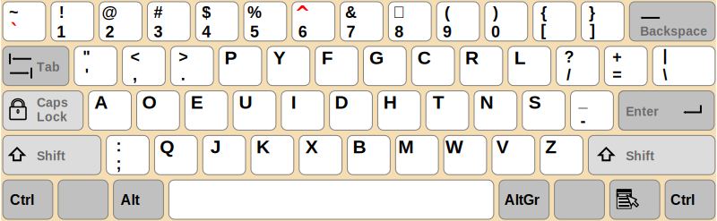
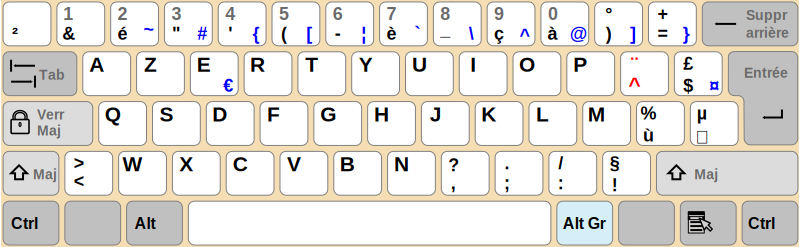
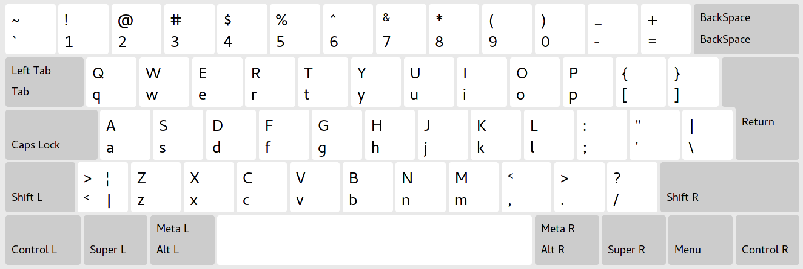
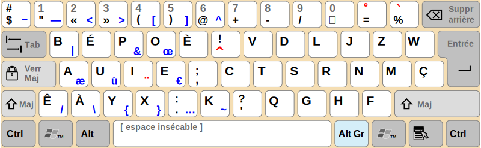
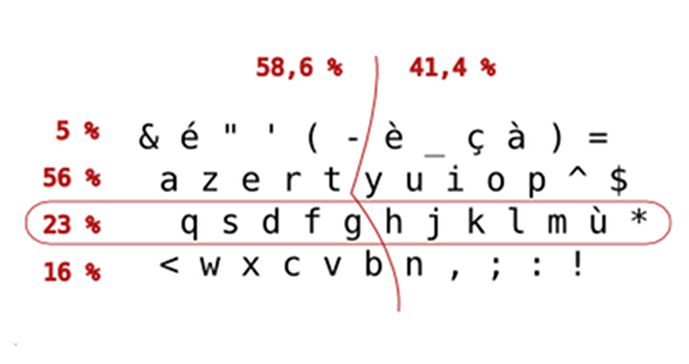
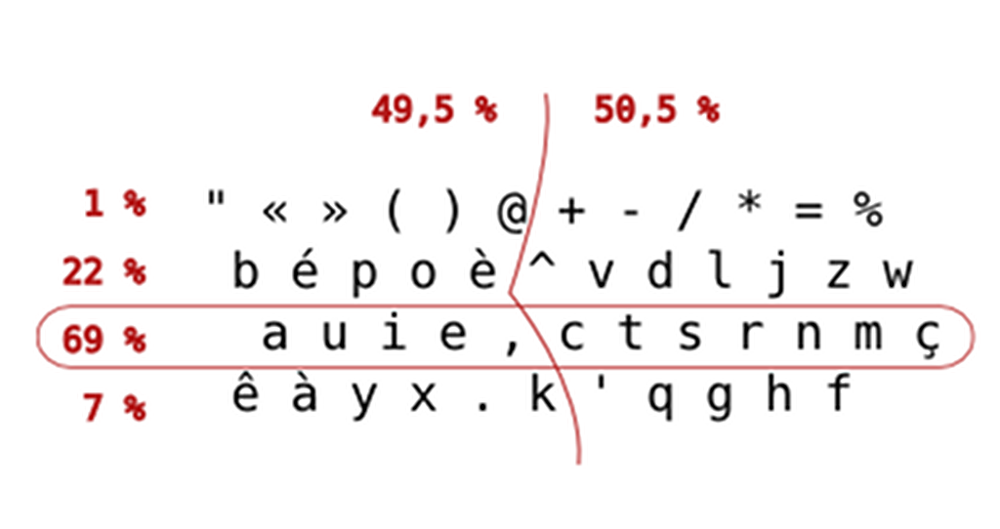
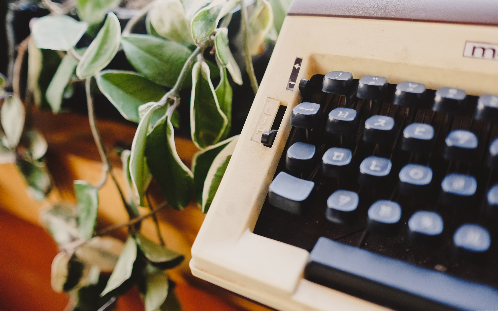

---

layout: ribbon

style: |

    #Cover h2 {
        margin:30px 0 0;
        color:#FFF;
        text-align:center;
        font-size:70px;
        }
    #Cover p {
        margin:10px 0 0;
        text-align:center;
        color:#FFF;
        font-style:italic;
        font-size:20px;
        }
        #Cover p a {
            color:#FFF;
            }
    #Cover .author {
      position: absolute;
      bottom: 10px;
      right: 10px;
      font-size: 30px;
      }
    #Picture h2 {
        color:#FFF;
        }
    .w img {
      max-width: 100%;
    }
    .h img {
      max-height: 100%;
    }
    #Questions h2 {
        display: inline-block;
        padding: 5px;
        padding-bottom: 10px;
        background-color: rgba(50,50,50,0.9);
        border-radius: 5px;
        color:#FFF;
        font-size:70px;
    }
---

# Ivre, il installe bépo et écrit mieux qu'avant
{:.cover #Cover}

*Julien Durillon*
{:.author}

<!-- photo by John Carey, fiftyfootshadows.net -->

## Moi

- Développeur & Ops @ Clever Cloud ;
- Vim <del>fag</del> user ;
- Pas touché à un traitement de texte de mon plein gré depuis 5 ans ;
- Français, écrit souvent des pavés.

## Pourquoi apprendre le BÉPO ?

1. En quelle langue écrivez-vous majoritairement ?
2. …Combien de caractères taperez-vous pendant toute votre vie ?
3. …Quelle distance parcourent vos doigts pendant une journée ?

## Un peu d'histoire

- **1868**: Invention du Typewriter (premier prototype construit).
- **1873**: Invention du QWERTY (disposition Sholes v1).
- **1873**: Commercialisation Typewriter v1 (± échec commercial).
- **1878**: Sortie du Typewriter v2 (énorme succès commercial).
- **1888**: Invention de la frappe à dix doigts.
- **1889**: Disposition Sholes v2 *#toolate*

// Sholes crée son prototype, puis s'associe avec un mécano et un marketeux.
// Problème: les digrammes touches trop proches se bloquent.
// Solution: séparer les touches des digrammes.
// Bonus: cacher TYPEWRITER sur la ligne du haut pour les vendeurs.

## Un Dvorak sauvage apparait

## Dvorak lance Vantardise

- ~18h pour apprendre from scratch le Dvorak
- ~58h pour apprendre from scratch le QWERTY
- ~56h pour apprendre le Dvorak en connaissant le QWERTY
- …Ces résultats expérimentaux ont été contestés
- …Le record du monde a été établi sur un Dvorak (212 mpm) (Barbara Blackburn).

## Le Dvorak sauvage s'enfuit

<figure markdown="1">

> I'm tired of trying to do something worthwhile for the human race. They simply don't want to change! #ragequit

<figcaption>@ADvorak</figcaption>
</figure>

## <del>Parlons</del>Écrivons français *#jesuiscirconflexe*

- Premier clavier "optimisé" pour le français : le Marsan, en 1976.
- Marsan a proposé un clavier physique différent.
- …Plus tard, en 2002, un clavier Dvorak-fr est proposé
- …Enfin, le BÉPO arrive.

## Le BÉPO

- Débute en 2007
- Résout des problèmes du Dvorak-fr
- Basé sur la méthode Dvorak
- Créé par consensus par la communauté

##  Now, let's troll!
{:.cover .w}

## Comparons les claviers : AZERTY

{:.w}

## Comparons les claviers : QWERTY

{:.w}

## Comparons les claviers : BÉPO

{:.w}

## Quelques (vraies) stats

{:.w}

## Quelques (vraies) stats

{:.w}

## Pourquoi apprendre le BÉPO (bis) ?

- …On bouge (2×) moins les doigts ;
- …On peut taper ฿ ; *#utile*
- …On peut écrire du français plus facilement ; *#fleurpellerin*
- …On apprend à taper à 10 doigts en aveugle, et c'est classe.
- …<del>On va plus vite ;</del>

## Comment apprendre ?

- [Klavaro](http://klavaro.sourceforge.net/)
- [http://tazzon.free.fr/dactylotest/bepodactyl/](http://tazzon.free.fr/dactylotest/bepodactyl/)
- N'importe quel logiciel « type tutor » supportant le bépo.

##  Questions?
{:.cover .w #Questions}
